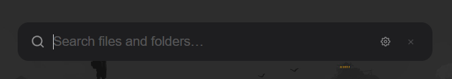
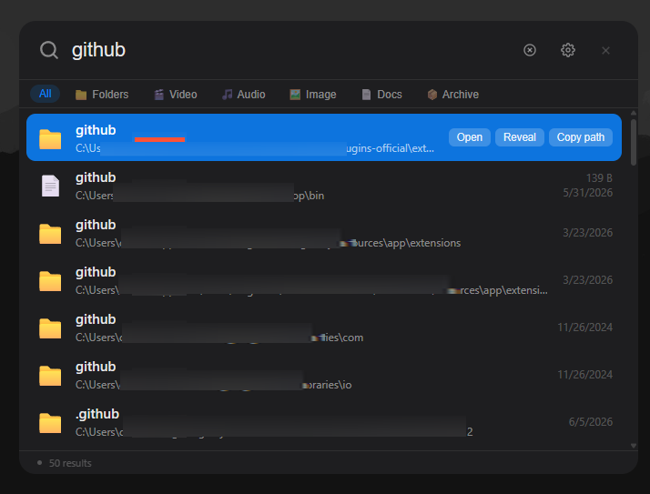
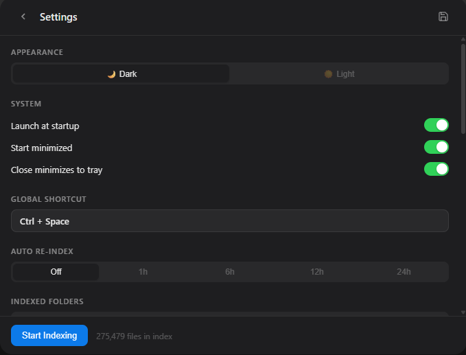

# LocaFetch

A blazing-fast file search launcher for Windows. Press a shortcut, type, find.


---

## What is LocaFetch?

LocaFetch is a keyboard-driven file search utility for Windows. Press **Ctrl + Space** from anywhere on your desktop and a clean search bar appears. Start typing and results show up instantly, powered by a local SQLite full-text index. Press **Escape** and it hides to the system tray, staying out of the way until you need it again.

It indexes your drives on first install, keeps the index live with a file system watcher, and never connects to the internet. Everything runs locally.

---

## Features

| Feature | Description |
|---|---|
| **Instant search** | FTS5 trigram index, results appear as you type |
| **Filter by type** | Chips to narrow results to Folders, Video, Audio, Images, Docs, or Archives |
| **Right-click context menu** | Open, Open with…, Reveal in Explorer, Copy path |
| **Open with…** | Native Windows "Open with" dialog for any file |
| **Live index updates** | File watcher keeps the index in sync — deletions, renames, and new files update within 2 seconds |
| **Reveal in Explorer** | Opens the parent folder and scrolls to the file |
| **System tray** | Runs silently in the background, no taskbar clutter |
| **Light / Dark theme** | Toggle in Settings, saved across sessions |
| **Launch at startup** | Optional Windows registry autostart |
| **Custom hotkey** | Change the global shortcut to anything you like |
| **Auto re-index** | Schedule periodic full re-scans (1h / 6h / 12h / 24h) |
| **Portable** | Single .exe, no runtime dependencies beyond Windows 10 |

---

## Preview







---

## Installation

### Option 1: Installer (recommended)

Download `LocaFetch_0.1.0_Installer.msi` from the [Releases](../../releases) page and run it. LocaFetch will be added to your Start Menu and can be removed from **Programs and Features**.

### Option 2: Portable

Download `LocaFetch_Portable.exe` from the [Releases](../../releases) page. Place it anywhere and double-click to run. No installation required. Your index and settings are stored in `%AppData%\com.locafetch.app`.

### Requirements

- Windows 10 (version 1803 or later) or Windows 11
- WebView2 Runtime, which is pre-installed on all Windows 11 and most Windows 10 systems. If missing, the installer will prompt you to download it.

---

## Quick Start

### 1. Launch LocaFetch

Double-click the exe or run the installer. The app starts in the system tray (look for the LocaFetch icon near the clock).

### 2. Open the search bar

Press **Ctrl + Space** anywhere on your desktop.

### 3. First run indexing

On first launch, LocaFetch automatically detects your drives (C:\, D:\, etc.) and indexes them in the background. A status indicator shows progress. This may take a few minutes depending on the number of files.

To manage indexed locations manually:
1. Press **Ctrl + ,** or click the gear icon to open Settings
2. Under **Indexed Folders**, add or remove drives and folders
3. Under **Excluded Folders**, add paths to skip
4. Click **Start Indexing** to rebuild

### 4. Search

Start typing. Results appear immediately. The index uses trigram full-text search, so searching `veng` will find `Avengers`.

### 5. Filter by type

Use the chips at the top of the results list:
- **All** - everything
- **Folders** - directories only
- **Video** - mp4, mkv, avi, mov, webm, wmv
- **Audio** - mp3, flac, wav, aac, ogg
- **Image** - jpg, png, gif, webp, svg, heic
- **Docs** - pdf, docx, xlsx, txt, md, csv
- **Archive** - zip, rar, 7z, tar, gz

### 6. Act on results

| Action | How |
|--------|-----|
| Open file | Click the result or press **Enter** |
| Open with… | Right-click the result → **Open with…** |
| Open in Explorer | Click **Reveal** or right-click → **Reveal in Explorer** |
| Copy path | Click **Copy** or right-click → **Copy path** |
| Navigate results | Up and Down arrow keys |
| Dismiss | Press **Escape** |

---

## Settings

Open Settings with **Ctrl + ,** or the gear icon.

### Appearance

Toggle between **Dark** and **Light** theme. The change applies instantly.

### System

| Setting | Default | Description |
|---------|---------|-------------|
| Launch at startup | On | Starts LocaFetch with Windows |
| Start minimized | On | Window stays hidden on launch |
| Close minimizes to tray | On | The X button hides instead of quitting |

### Global Shortcut

Change the keyboard shortcut:
1. Click the shortcut box
2. It turns blue and prompts you to press a combination
3. Hold your modifier keys (Ctrl, Alt, Shift, or Win) and press a key
4. Click **Apply** to confirm

Supported modifiers: Ctrl, Alt, Shift, Win

Supported keys: A-Z, 0-9, F1-F12, Space, Enter, Tab, Escape, Delete, Backspace

### Auto Re-index

Schedule periodic full re-scans:
- **Off** - manual only
- **1h / 6h / 12h / 24h** - background re-scan every N hours

### Indexed Folders

Add the drives or folders you want searchable. Click **Add all drives** to auto-populate.

### Excluded Folders

Folders added here are skipped. LocaFetch also automatically skips:

- `AppData\Local\Temp` and `AppData\LocalLow`
- Browser caches (Chrome, Edge, Brave, Firefox)
- Windows Update staging directories
- `node_modules`, `.git`, `__pycache__`, `.next`
- `target\debug`, `target\release`
- Generic `\cache\` and `\caches\` directories

---

## How It Works

The indexer walks your configured folders using walkdir and writes file records into a SQLite database with FTS5 trigram search. The file watcher uses the notify crate to listen for changes and updates the index in real time. The frontend communicates with the Rust backend via Tauri invoke calls.

- **Indexer** (indexer.rs) — walks folders, batches 500 rows per SQLite transaction
- **FTS5 trigram** — enables substring search, falls back to LIKE for short queries
- **File watcher** (watcher.rs) — debounces events and flushes to DB every 2 seconds; handles create, delete, rename
- **Open with** — uses `SHOpenWithDialog` Win32 API for native Windows integration
- **Frontend** (React + TypeScript) — dynamically resizes the window to fit content; clears on each open

---

## Building from Source

### Prerequisites

- [Rust](https://rustup.rs/) stable toolchain
- [Node.js](https://nodejs.org/) 18 or later
- Tauri CLI v2: `npm install -g @tauri-apps/cli`

### Steps

```bash
git clone https://github.com/chamalkalakshan/LocaFetch.git
cd LocaFetch
npm install
npm run tauri dev
```

To produce a release build:

```bash
npm run tauri build
```

Artifacts will be at:
- `src-tauri/target/release/locafetch.exe`
- `src-tauri/target/release/bundle/msi/LocaFetch_0.1.0_x64_en-US.msi`

---

## Keyboard Reference

| Shortcut | Action |
|----------|--------|
| **Ctrl + Space** | Toggle search window (customizable) |
| **Up / Down** | Navigate results |
| **Enter** | Open selected file |
| **Escape** | Clear query and hide window |
| **Ctrl + ,** | Open Settings |
| **Right-click** | Context menu — Open with, Reveal, Copy path |

---

## Contributing

Contributions are welcome. Please open an issue first to discuss what you want to change.

---

## Contributors

| Name | Role |
|------|------|
| [chamalkalakshan](https://github.com/chamalkalakshan) | Creator and maintainer |

---

## License

MIT. See [LICENSE](LICENSE) for details.
